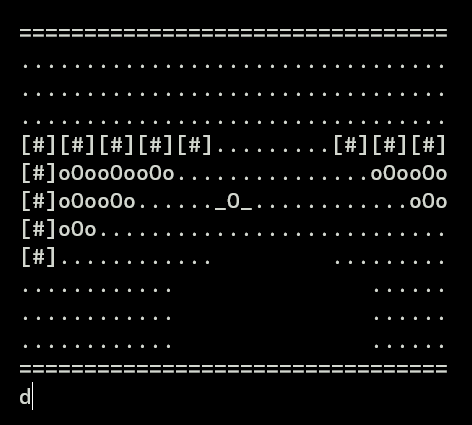

Versión del laberinto implementado con arrays asociativos, para contrastarlo con la solución que se implementa con arrays.

Se utilizan los mapas de Ultima III: [Castillo de Lord British](https://userpages.monmouth.com/~colonel/videogames/ultimaexodus/british.html), [Castillo de Timelord](https://userpages.monmouth.com/~colonel/videogames/ultimaexodus/time.html)

## Restricciones autoimpuestas

- Intentar KISS
- CNC / ANC

## Versiones

### Versión 1

> [Versión de partida](ArrayAsociativo001.java)

* Impresión completa del mapa mediante imprimeMapa()
* Traducción (parseo) de los tiles mediante mapea()

<div align=center>
    
</div>

### Versión 2

> [Versión 2](ArrayAsociativo002.java)

Ajuste en la implementación de la impresión del mapa, mediante la inclusión de un viewport, que muestra una parte del mundo centrada alrededor de un punto. En los juegos, habitualmente este punto es el personaje principal, por lo que:

* Se crea una estructura de datos que almacene la posición del personaje, en la forma de un array posicionPersonaje que almacenará como primer elemento la fila y como segundo elemento la columna.
* Se crean las constantes *FILA* y *COLUMNA* para poder referirnos de manera clara a la posición: *posicionPersonaje[FILA]* y *posicionPersonaje[COLUMNA]*. 
* Se modifica *imprimeMapa*:
    * Cambio de nombre a *imprimeMundo*, más adecuado a su función dado que ya no imprime únicamente el mapa, sino que además ubica al personaje.
    * Se le pasan parámetros adicionales: *posicionPersonaje* y tamaño del *viewport*.
    * Se le da la responsabilidad adicional de imprimir al personaje en la posición especificada. ```_O_```
* Se agrega la funcion *imprimeLinea* que imprime una línea horizontal del tamaño del viewport.  

<div align=center>
    
</div>

### Versión 3

> [Versión 3](ArrayAsociativo003.java)

Partimos de la premisa que hemos abstraido a nuestro personaje y el dato que nos interesa de él, **la posición**, en el vector posicionPersonaje, de modo que *fila=5, columna=3* queda almacenada así:

```
    int[] posicionPersonaje = {5,3}
```

#### ¿Qué es moverse?

A partir de esta abstracción, moverse sería cambiar dichas coordenadas. Con esto en mente:

- Si queremos que el personaje suba, restamos 1 a la fila y nos queda: ```{4,3}```
- Si queremos que el personaje baje, sumamos 1 a la fila y nos queda: ```{6,3}```
- Si queremos que el personaje vaya a la izquierda, restamos 1 a la columna y nos queda: ```{5,2}```
- Si queremos que el personaje vaya a la derecha, sumamos 1 a la columna y nos queda: ```{5,4}```

Por tanto, moverse sería sumar una unidad a la dimensión adecuada del vector del personaje.

<div align="center">

|Dirección|Cambio
|-|-
|Arriba|```{-1,0}```
|Abajo|```{1,0}```
|Izquierda|```{0,1}```
|Derecha|```{0,-1}```

</div>

Es decir que moverse significaría elegir una dirección y sumar ese vector al vector de posición del personaje.

<div align="center">

**Moverse = Posición + Dirección**

|Posición inicial|Dirección|Moverse|Posición final
|:-:|-|-|:-:
|```{5,3}```|Arriba|```{5,3} + {-1,0}```|```{4,3}```
|```{5,3}```|Abajo|```{5,3} + {1,0}```|```{6,3}```
|```{5,3}```|Izquierda|```{5,3} + {0,1}```|```{5,4}```
|```{5,3}```|Derecha|```{5,3} + {0,-1}```|```{5,2}```

</div>

##### Abstracción del movimiento

Podemos hacer que la fórmula ***Moverse = Posición + Dirección*** quede abstraida tal que la nueva posición del personaje sea la posicion actual más la suma de la dirección a la que 

nuevaPosicion = posicionPersonaje + vectorMovimiento(unaDirección)

Si hacemos que el vector movimiento sea:

```
MOVIMIENTO = { 
	{ -1, 0 },
	{ 1, 0 },
	{ 0, -1 },
	{ 0, 1 }
};
```

Y si además definimos las siguientes constantes:

```
static final int ARRIBA = 0;
static final int ABAJO = 1;
static final int IZQUIERDA = 2;
static final int DERECHA = 3;
static final int SALIR = 4;
```

Entonces, el vector de movimiento hacia arriba ```{-1,0}``` quedaría referenciado de esta manera:

```
MOVIMIENTO[ARRIBA] 
```

Y como anteriormente hemos abstraido fila y columna en las constantes FILA y COLUMNA, el movimiento de la fila sería ```MOVIMIENTO[ARRIBA][FILA]``` y en la columna sería ```MOVIMIENTO[ARRIBA][COLUMNA]```

Con esto en mente podemos crear un método *mover* que se responsabilice por mover el personaje. Lo que le haría falta saber es la posición del personaje y dirección hacia la que se mueve.

```
static void mover(int[] unPersonaje, int direccion) {

    unPersonaje[FILA] = unPersonaje[FILA] + MOVIMIENTO[direccion][FILA];
    unPersonaje[COLUMNA] = unPersonaje[COLUMNA] + MOVIMIENTO[direccion][COLUMNA];
}
```

Definido esto, los métodos *verAccion*, *capturaMovimiento* y *pedirChar* colaboran entre ellos para permitir al usuario indicar adónde moverse usando los numeros direccionales (8/4/6/2) o las teclas habituales (w/a/s/d).

En el main del programa se agrega un bucle que se encarga de imprimir el mapa y pedirle al usuario que indique una dirección de movimiento (o de terminar, cuando el booleano ```jugando``` pasa a false, tarea de la que se encarga el método *verAccion*):

```
do {
    imprimirMundo(castilloLB, elPersonaje, viewPort);
    verAccion(elPersonaje);
} while (jugando);
``` 

Esta versión mueve al personaje pero ni verifica límites ni tampoco verifica el terreno sobre el cual se mueve el personaje, por lo que de momento el personaje podrá moverse libremente atravesando paredes y agua. Asimismo, si se acerca mucho a los límites de la pantalla, el programa lanzará un error: ambas situaciones serán abordadas en las siguientes versiones.

<div align=center>
    
</div>

### Versión 4

> [Versión 4](ArrayAsociativo004.java)

Igual que la versión 3, salvo que esta en lugar de acumular la impresión del mapa, limpiar pantalla mediante códigos ANSI y hace más interesante el efecto de "movimiento".


### Versión 5

[Hora y sol](ArrayAsociativo005.java)


### Versión 6

[Versión 6](ArrayAsociativo006.java): alcance de visión en función a la hora y el sol / Corrección del "error" del método estático pedirChar() y justificación de por qué aquí sí es pertinente un comentario. 

### Versión 7

[Versión 7](ArrayAsociativo007.java): un poco de color y ajustes menores de código

### Versión 8

[Versión 8](ArrayAsociativo008.java): protección en los límites del mapa

### Versión 9

[Versión 9](ArrayAsociativo009.java): Opción de skins (se activa con la letra **v**), como ayuda para el desarrollo de la detección de por dónde puede y no puede caminar. 


|Skin 0|Skin 1|Skin 2|Skin 3
|-|-|-|-
||||
|Full color|Sin color|Tiles puros|Matriz colisiones

* Las skin 1 y 2 son similares en el concepto de parsear el mapa almacenado, con la diferencia de la inclusión del color. 
* La skin 2 muestra el mapa con los tiles tal y como los tiene almacenados el programa. 
* La skin 3 muestra la "matriz de colisiones", es decir, los puntos por los que no debería permitirse el paso al personaje.

De una forma básica (o sea, *hardcoded*) verifica si puede ir al sitio que le piden: no permite traspasar paredes ni agua. 

    Ideas para las siguientes versiones: 
    - Generalizarlo a un "medio de transporte"
    - ¿Incluir altura y profundidad?
    - ¿Poder crear un puente?
