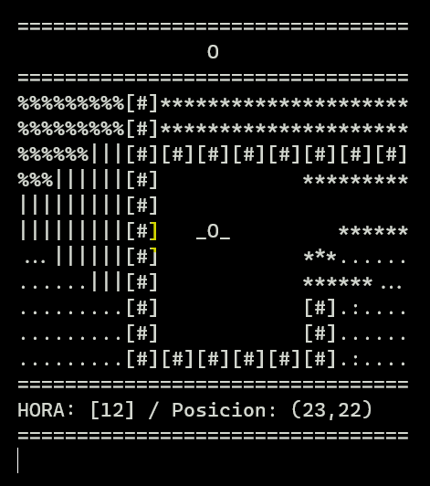

# Versión 5: tiempo, un reloj y el sol en el cielo (moviéndose en función al tiempo)

> [Hora y sol](ArrayAsociativo005.java)

Implementamos:

* [El tiempo](https://github.com/mmasias/misApuntes/blob/a0493da8552d566407f4f1b6329ea58f16982676/PROGRAMACION-1/mapasConArrayAsociativo/ArrayAsociativo005.java#L169), que avanza [en cada turno](https://github.com/mmasias/misApuntes/blob/a0493da8552d566407f4f1b6329ea58f16982676/PROGRAMACION-1/mapasConArrayAsociativo/ArrayAsociativo005.java#L162). 
* En la parte inferior, [agregamos una barra de estado](https://github.com/mmasias/misApuntes/blob/a0493da8552d566407f4f1b6329ea58f16982676/PROGRAMACION-1/mapasConArrayAsociativo/ArrayAsociativo005.java#L199) que muestre el reloj (que de momento muestra solo la hora) y la posición del personaje. 
* [El cielo en la parte superior](https://github.com/mmasias/misApuntes/blob/a0493da8552d566407f4f1b6329ea58f16982676/PROGRAMACION-1/mapasConArrayAsociativo/ArrayAsociativo005.java#L286), que muestra el sol en el día (sale a las 6:00h, a las 12:00h está en mitad del cielo y se oculta a las 18:00h).

    

