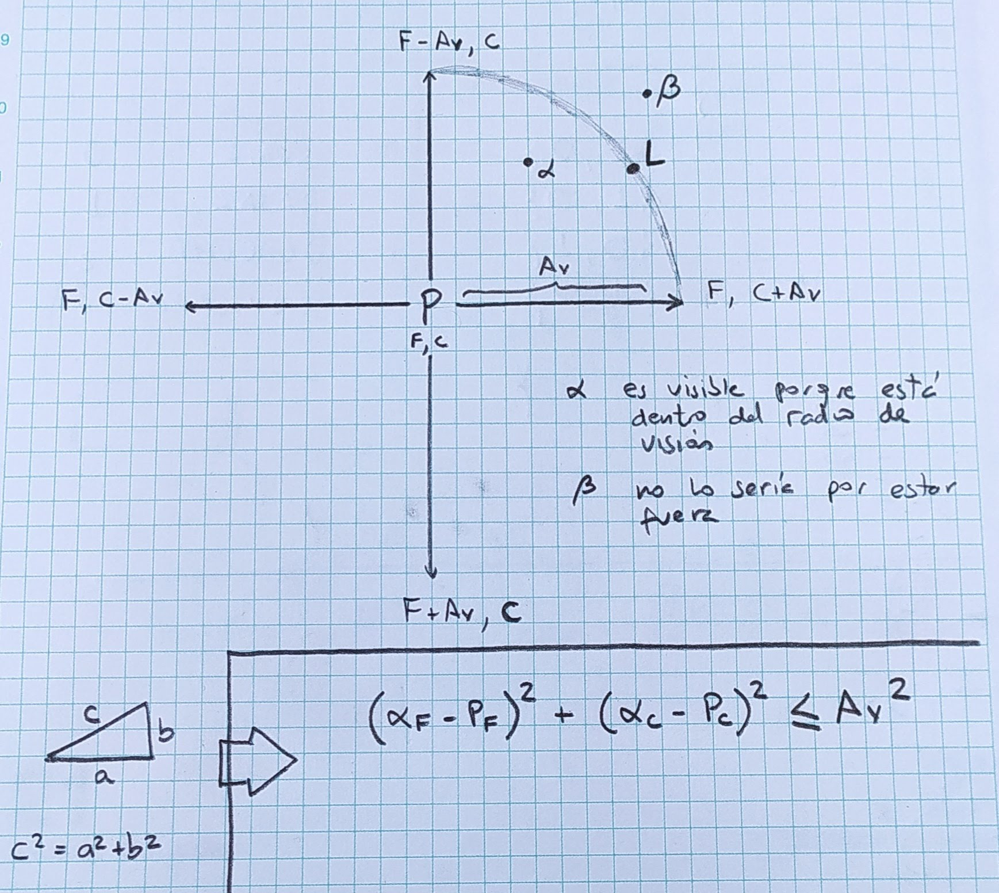

# Versión 6: día y noche en función de la hora

> [Dia y noche](ArrayAsociativo006.java): iluminación y alcance de visión en función a la hora y el sol / Corrección del "error" del método estático pedirChar() y justificación de por qué aquí sí es pertinente un comentario. 

## Alcance de visión (o para qué sirven las matemáticas...)

Teniendo en el centro al personaje P y definiendo además un alcance de visión Av, los puntos que pueden verse son los que están dentro del alcance de visión (α); mientras que las que estén fuera de este alcance (β) no. El problema entonces consiste en determinar cuáles son los puntos que están dentro y cuales fuera, lo cual puede hacerse por trigonometría: el límite es Av² (hipotenusa de un triángulo rectángulo y a la vez radio del círculo) y las coordenadas de los puntos serían la posición del punto menos la posición del personaje (α-P), tal que:


<div align=center>
    
</div>

Aterrizándolo a código, con las variables que manejamos, la condición de visibilidad a comprobar sería:

```
Math.pow((fila - personaje[FILA]), 2)+ Math.pow((columna - personaje[COLUMNA]), 2) <= alcanceVision * alcanceVision
```

Condición que se ha incluido en la función *imprimirMundo* para "apagar" los puntos que no caen dentro de este rango.

## Corrección de pedirChar()

El programa no avanzaba el tiempo si únicamente se pulsaba enter. Las deliberaciones técnicas (que incluyen un debate que abordaba la identificación de un salto de línea, retorno de carro, dependencia de la plataforma, etc.) pueden ser excesivas para este documento: si me da el tiempo las extiendo en otro readme. 

¡Pero! El tema se ha resuelto construyendo un string conformado por lo que ingresa el usuario y un carácter cualquiera ('x' en este caso) y capturando el primer caracter. 

```
static char pedirChar() {

    Scanner entrada = new Scanner(System.in);
    String inputUsuario = entrada.nextLine() + "x"; // Este es un caso sí que justifica un comentario!
    return inputUsuario.charAt(0); 
}
```

Si el usuario no ingresa nada, el primer caracter será 'x'. Si el usuario ingresa algo, el primer caracter será precisamente lo ingresado por el usuario. Esta breve explicación sí califica como algo que deba dejarse comentado en la función.