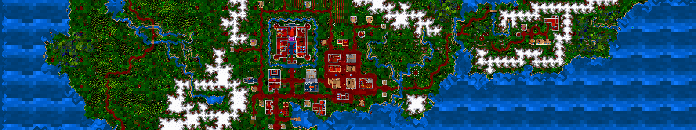

||
|-:|
                
<i>La sencillez es una virtud que requiere mucho trabajo para lograrla y educación para apreciarla. Y para empeorar las cosas, la complejidad se vende mejor - <b>Edsger W. Dijkstra - On the nature of Computing Science</b></i>  
   
***[ingeniero, ra](docs/temasVarios/ingeniero.md)***: *m. y f. `[iŋ.xeˈnje.ɾo]`* *Persona&nbsp;que&nbsp;realiza&nbsp;conjeturas&nbsp;precisas&nbsp;basadas&nbsp;en&nbsp;datos&nbsp;poco&nbsp;fiables proporcionados por personas de conocimiento dudoso (véase también ***mago*** o ***hechicero***)*
              
