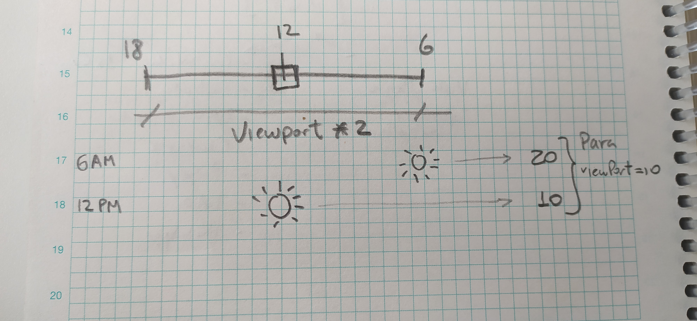

# Versión 5: tiempo, un reloj y el sol en el cielo (moviéndose en función al tiempo)

> NOTA: Simplificación del método que calcula el sol

> [Hora y sol](../ArrayAsociativo005.java)

Implementamos:

* [El tiempo](https://github.com/mmasias/misApuntes/blob/a0493da8552d566407f4f1b6329ea58f16982676/PROGRAMACION-1/mapasConArrayAsociativo/ArrayAsociativo005.java#L169), que avanza [en cada turno](https://github.com/mmasias/misApuntes/blob/a0493da8552d566407f4f1b6329ea58f16982676/PROGRAMACION-1/mapasConArrayAsociativo/ArrayAsociativo005.java#L162). 
* En la parte inferior, [agregamos una barra de estado](https://github.com/mmasias/misApuntes/blob/a0493da8552d566407f4f1b6329ea58f16982676/PROGRAMACION-1/mapasConArrayAsociativo/ArrayAsociativo005.java#L199) que muestre el reloj (que de momento muestra solo la hora) y la posición del personaje. 
* [El cielo en la parte superior](https://github.com/mmasias/misApuntes/blob/a0493da8552d566407f4f1b6329ea58f16982676/PROGRAMACION-1/mapasConArrayAsociativo/ArrayAsociativo005.java#L286), que muestra el sol en el día (sale a las 6:00h, a las 12:00h está en mitad del cielo y se oculta a las 18:00h).

    

## Simplificación & explicación de imprimirElCielo()

En esta función hemos de determinar la posición del sol en una representación lineal del cielo en función de la hora del día.

Se busca representar el movimiento del sol de derecha a izquierda a través de una representación lineal del cielo durante el rango de 6 AM a 6 PM, dividiendo el cielo en 12 segmentos para cada hora.

La fórmula es `((viewPort * 2)) - ((hora - 6) * (viewPort * 2) / 12)`.

1. **Rango de horas (`hora - 6`):** La expresión `(hora - 6)` ajusta la hora para que comience en 0 a las 6 AM. Entonces, a las 6 AM, esto se convierte en 0; a las 7 AM, en 1; y así sucesivamente hasta las 6 PM, que se convierte en 12.

2. **Proporción del día (`* (viewPort * 2) / 12`):** Aquí, `(viewPort * 2) / 12` divide el ancho total del cielo, representado por `viewPort * 2`, en 12 segmentos. Cada segmento representa una hora del día. Multiplicar `(hora - 6)` por este valor calcula la posición del sol en esta representación lineal del cielo, basada en la hora actual.

3. **Posición absoluta (`viewPort * 2 - ...`):** La parte `viewPort * 2 -` calcula la posición del sol restando su posición relativa (calculada en el paso anterior) del ancho total. Esto sugiere que el sol se mueve de derecha a izquierda a lo largo del día.

### Ejemplo de Cálculo

Supongamos que `viewPort` es 10. Entonces `viewPort * 2` es 20, representando el ancho total del cielo.

    

- A las 6 AM (`hora = 6`), la fórmula sería `20 - ((6 - 6) * 20 / 12)`, lo que da 20. Esto coloca el sol en el extremo derecho.
- A las 12 PM (`hora = 12`), sería `20 - ((12 - 6) * 20 / 12)`, lo que resulta en 10, ubicando el sol justo en el medio.
