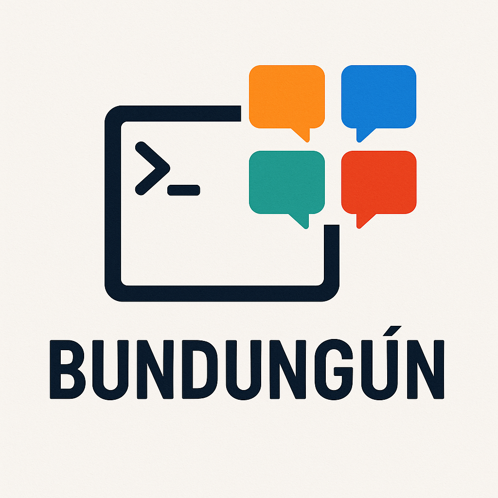

# :apple:

Esto es un fork del [script de configuración para GNU/Linux](../GNU.Linux/README.md), adaptado para macOS. La idea, el menú y la filosofía son los mismos: automatizar hasta donde es posible todo lo que hay que hacer cuando se configura un Mac nuevo (o cuando se reinstala). La diferencia está bajo el capó: aquí no hay `apt`, ni `dnf`, ni `pacman` — hay **Homebrew**, hay **iTerm2**, y hay **osascript** en lugar de Terminator.

```console
SCRIPT DE CONFIGURACIÓN macOS
manuel@macOS 15.4.1 (Apple Silicon (arm64))
git: manuel@macMini | Chrome | VSCode | Agentes: [C/O/G/Q]/X/H
==============================================

1)  Todo!                                     2)  Dependencias básicas + Homebrew
3)  Configurar Git                            4)  Google Chrome
5)  JDK & graphviz                            6)  PlantUML
7)  Visual Studio Code                        8)  Workspace IA (Agentes + bundungun)
9)  GitHub CLI                                10) Configurar firma GPG
11) Spotify                                   12) VLC
13) Utilitarios                               14) oh-my-posh
15) Carpeta repo                              16) Descargar repos
17) Limpiar sistema                           18) Quitar bloatware
19) SysInfo                                   20) Ver estado
99) Salir

Ingresa tu opción:
```

## Instalación rápida

### Automática (instalación completa)
```bash
curl -fsSL https://raw.githubusercontent.com/mmasias/mmasias/main/macOS/setup-macos.sh | bash
```

### Interactiva (menú de opciones)
```bash
curl -O https://raw.githubusercontent.com/mmasias/mmasias/main/macOS/setup-macos.sh
bash setup-macos.sh
```

> TsP / TpR: 20 min / 35 min
>
> TsP: Tiempo en ser productivo | TpR: Tiempo productividad recuperada
>
> **Nota**: en macOS el TpR es ligeramente mayor porque Homebrew descarga binarios en lugar de compilar (rápido), pero la primera instalación del toolchain de Xcode Command Line Tools puede añadir unos minutos la primera vez.
>
> Agradecimientos a [Claude (Anthropic)](https://claude.ai) por ayudar a portar y mantener este script desde su versión Linux.

Las secciones siguientes son solo para instalación manual o puntual. Si ya usas el script, no necesitas repetirlas.

## Qué hace el script (resumen)

- Detecta si corres en **Apple Silicon** o **Intel** y ajusta los paths de Homebrew en consecuencia.
- Instala y actualiza **Homebrew** si no está presente.
- Instala Chrome y pausa para que configures el navegador por defecto y hagas login en GitHub antes de continuar.
- Configura Git (nombre/email), GPG con **pinentry-mac** (integración con el llavero de macOS) y GitHub CLI + extensión Classroom.
- Java (elige entre Temurin 11/17/21 u OpenJDK), graphviz, PlantUML; VSCode via cask.
- Node.js v24 vía nvm, agentes de IA (`claude-code`, `gemini-cli`, `codex`, `qwen-code`, `opencode-ai`, `@z_ai/coding-helper`).
- Utilitarios: tree, htop, fastfetch, bat, fd, ripgrep, tmux, vim, eza, DOSBox-X, KDEnLive.
- Virtualización: **VirtualBox** en Intel; en Apple Silicon ofrece también **UTM** (recomendado).
- oh-my-posh con Nerd Fonts (FiraCode y MesloLG) instaladas via cask, tema configurable (por defecto: nordtron).
- Crea `~/misRepos`, puede clonar/actualizar tus repos de clase y dejar el terminal apuntando allí.
- Limpieza de "bloatware" macOS (GarageBand, iMovie) con confirmación.

## Diferencias respecto al script de Linux

| Aspecto | GNU/Linux | macOS |
|---|---|---|
| Gestor de paquetes | apt / dnf / pacman | **Homebrew** |
| Detección del sistema | familia de distro | **arquitectura** (arm64 / x86_64) |
| Apps GUI | paquetes del repo | `brew install --cask` |
| Terminal multi-panel | Terminator | **iTerm2** |
| bundungun | `--layout=sabios` en Terminator | **osascript** (4 splits en iTerm2) |
| GPG pinentry | gnome3 / qt / gtk (según DE) | **pinentry-mac** (llavero nativo) |
| Nerd Fonts | descarga ZIP manual | `brew install --cask font-*` |
| oh-my-posh temas | `~/.poshthemes/` | `$(brew --prefix oh-my-posh)/themes/` |
| neofetch | neofetch | **fastfetch** (neofetch deprecado en brew) |
| Virtualización | VirtualBox | VirtualBox (Intel) / **UTM** (Apple Silicon) |
| Bloatware | Firefox, LibreOffice, Thunderbird | **GarageBand, iMovie** |

## iTerm2 con layout "sabios"

Al igual que en Linux con Terminator, el script configura un workspace de 4 paneles en iTerm2. Cada panel arranca directamente un agente de IA:

- **Panel superior izquierdo**: Claude Code (`claude`)
- **Panel superior derecho**: Gemini CLI (`gemini`)
- **Panel inferior izquierdo**: OpenCode AI (`opencode`)
- **Panel inferior derecho**: Qwen Code (`qwen`)

La disposición se genera mediante AppleScript (osascript), por lo que no requiere ningún plugin adicional de iTerm2.

## Lanzador bundungun



El lanzador `bundungun` funciona exactamente igual que en Linux: se ejecuta desde cualquier directorio, conserva la ubicación actual y abre los 4 agentes listos para trabajar. La diferencia interna es que en macOS usa `osascript` para orquestar iTerm2 en lugar de los argumentos de Terminator.

```bash
bundungun
```

El script instala `bundungun` en `~/.local/bin/` y se asegura de añadir esa ruta al PATH en **ambos** `~/.zprofile` y `~/.zshrc`. Esto es necesario porque en macOS los terminales abren por defecto **login shells**, que cargan `.zprofile` antes que `.zshrc`, y sin este detalle `bundungun` no sería reconocido en ventanas nuevas.

Si instalaste el script en una sesión anterior y `bundungun` no se reconoce en terminales nuevos, añádelo manualmente:

```bash
echo 'export PATH="$HOME/.local/bin:$PATH"' >> ~/.zprofile
```

## Nota sobre Apple Silicon

El script detecta automáticamente la arquitectura. En Apple Silicon (`arm64`):

- Homebrew se instala en `/opt/homebrew` (en vez de `/usr/local`).
- Para virtualización, se ofrece **UTM** como alternativa recomendada (gratuito, nativo, disponible también en la App Store). VirtualBox 7.1+ ya tiene soporte experimental para arm64.
- El resto del toolchain funciona igual: Homebrew distribuye binarios nativos arm64 para la mayoría de las fórmulas.

## Verificación de estado (opción 20)

```console
======================================
  ESTADO DE INSTALACIÓN
======================================
Sistema: macOS 26.4.1 — Apple Silicon (arm64)

━━━━━━━━━━━━━━━━━━━━━━━━━━━━━━━━━━━━━━
HERRAMIENTAS BÁSICAS
━━━━━━━━━━━━━━━━━━━━━━━━━━━━━━━━━━━━━━
Homebrew:                                ✓ INSTALADO
curl:                                    ✓ INSTALADO
wget:                                    ✓ INSTALADO
git:                                     ✓ INSTALADO

━━━━━━━━━━━━━━━━━━━━━━━━━━━━━━━━━━━━━━
CONFIGURACIÓN DE GIT
━━━━━━━━━━━━━━━━━━━━━━━━━━━━━━━━━━━━━━
Git user.name:                           ✓ CONFIGURADO
Git user.email:                          ✓ CONFIGURADO
Git GPG signing:                         ✓ CONFIGURADO

━━━━━━━━━━━━━━━━━━━━━━━━━━━━━━━━━━━━━━
AGENTES DE IA
━━━━━━━━━━━━━━━━━━━━━━━━━━━━━━━━━━━━━━
Claude Code:                             ✓ INSTALADO
Gemini CLI:                              ✓ INSTALADO
Codex:                                   ✓ INSTALADO
Qwen Code:                               ✓ INSTALADO
```
