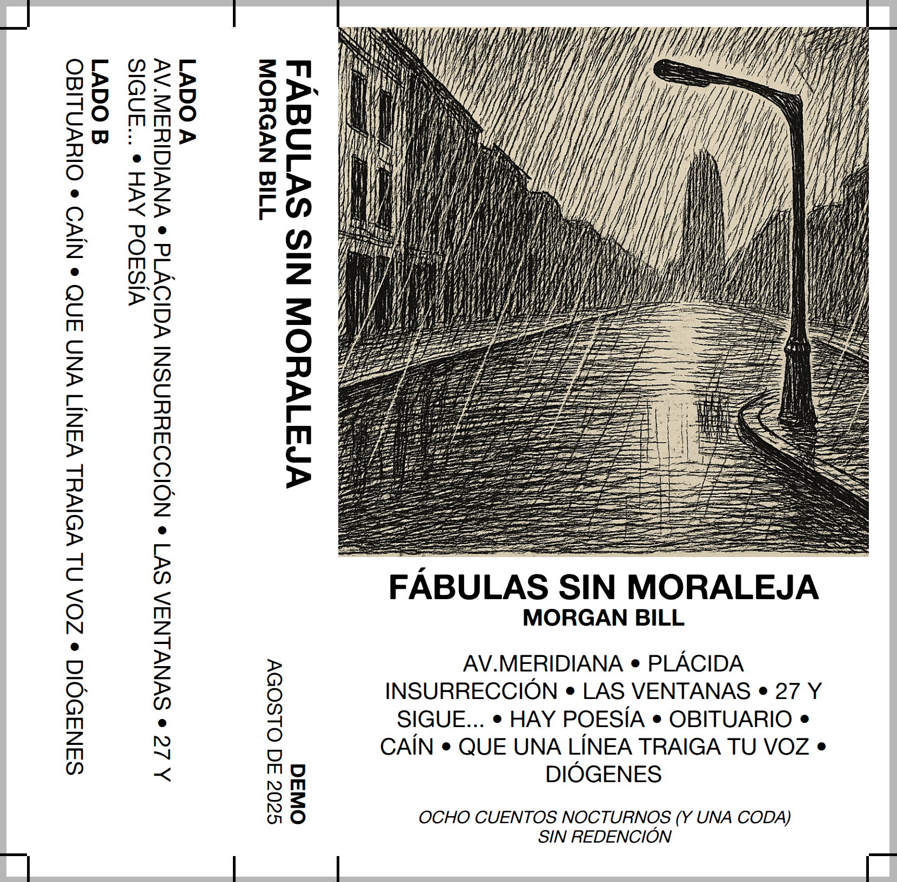
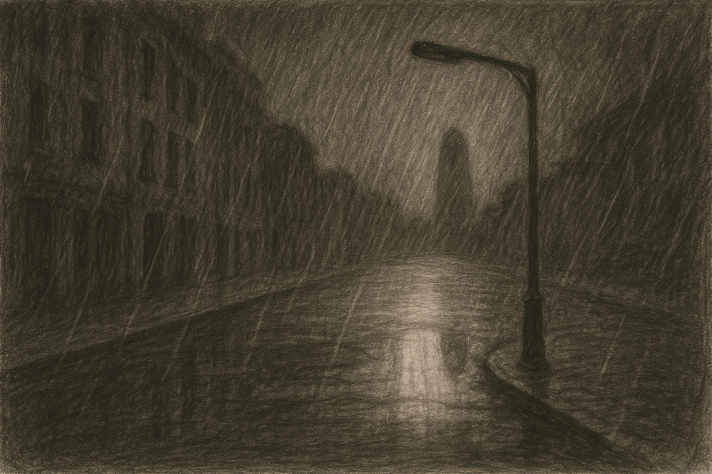
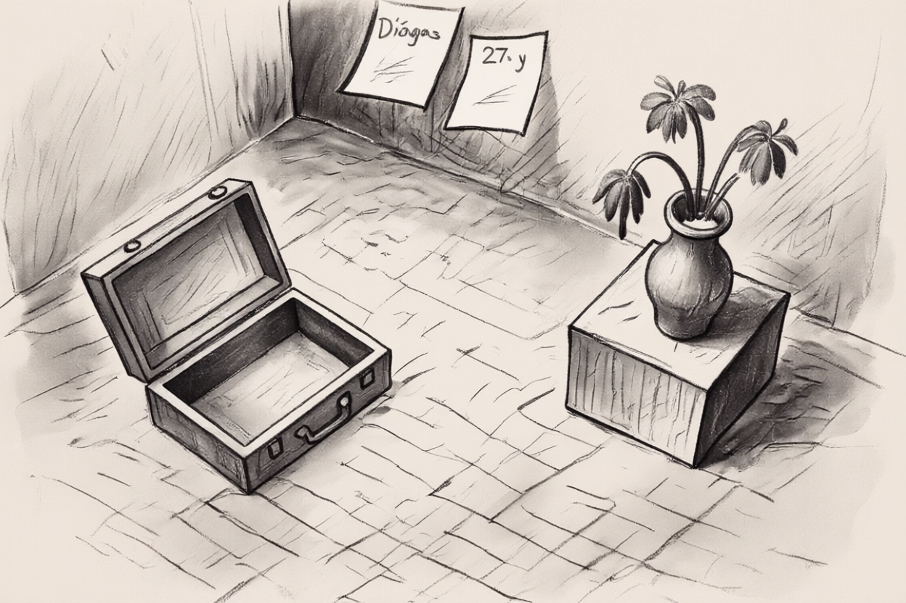
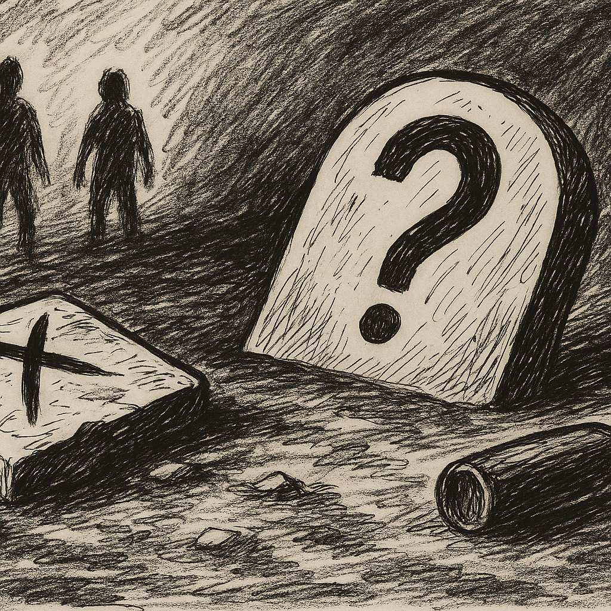
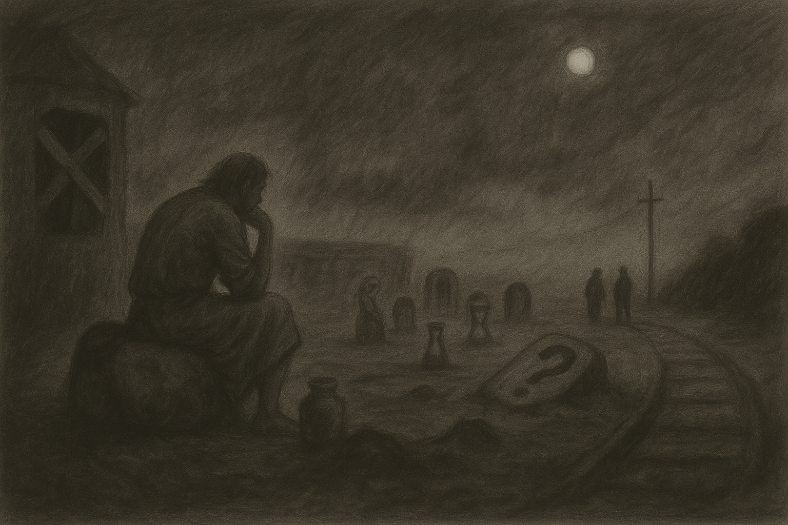

# Fábulas sin moraleja

|
|:-:
|Ocho cuentos nocturnos (y una coda) sin redención.
|
**Un album de *Morgan Bill***

<i>"¿Qué significa ser un animal consciente de sí mismo? La idea es ridícula, si no monstruosa. Significa saber que uno es alimento para gusanos.” - Ernest Becker</i>i>

## Temas

### Av. Meridiana

Me alcanzó una lluvia fría  
paseando en Meridiana  
y por no mojarte el alma  
mejor te veo otro día  
  
Caminando se me pasa  
y en la calle un apagón  
sacudió los pensamientos  
llamando a la inspiración  
  
*Mediqué la redacción*  
*pero me faltaba luz*  
*y aunque te hice una canción (un blues)*  
*no lo pude escribir*  
  
Creo que hablaba de las cosas  
que nos han pasado y junto  
a tu recuerdo borroso  
hasta me hizo sonreír  
  
Lo que queda escrito ahora  
lo robé a la memoria  
y aunque no sea ni su sombra  
algo tendrá que decir  
  
*Luego regresé a mi cuarto*  
*pues mi cama me dolía*  
*No me llama la atención*  
*que mi casa esté vacía*  

### Plácida insurrección

Media mañana perdida en una estación  
por culpa de algún cretino que nunca llegó  
y que ha dejado sus pasos repasando otros ritmos varios  
  
Ha convencido a su alma que la solución  
pasa por hacer a un lado lo que no pasó  
y abajo la tiranía de los recuerdos y de la pasión  
  
*Ahora se sienta*  
*aturdida ante la duda*  
*de saber si la fortuna*  
*en algún rincón perdido*  
*ya le sonrió...*  
  
Le han invitado esta noche otra vez a llorar  
Se está planteando en secreto volver a faltar:  
Pues hay terapias más simples que al final están igual de mal  
  
Sueña volver a los vicios de la juventud  
esos que años atrás le sentaban tan mal  
y cuyos puntos finales terminaban en perversos bares  

### Las ventanas

Las ventanas de aquel cuarto no conocían al sol  
y los poemas vacíos describían el rincón  
de un alma atormentada deambulando en el salón  
al que todos los domingos visitaba la razón...  
  
La vida le ha vestido de azulado-represión  
que a menudo se contempla al otro lado del salón  
Acallar en lo que él cree le inquieta el corazón  
pendular la ideología que gobierna su nación...  
  
Barcelona por las noches no disipa su dolor  
aún con todos los colores que su espíritu probó  
Genuflexas posiciones de lujuria y de oración  
que a menudo las practica sin angustia en el salón...  
  
Convertía sus temores en acordes de canción  
y la épica ligera adornaba su expresión  
escribiendo alejandrinos carentes de convicción  
A menudo se imagina sin angustia en el salón...  

### 27, y sigue...

Se abalanzó a la ventana al llegar la puesta del sol  
y se juró que mañana lo haría un poco peor  
desayunando las drogas que hacía para cenar  
ya entraría en calor en el trecho que aún tiene que andar  
  
Sus veintinueve febreros cumplidos le hacen recordar  
que hace dos años se quedó a las puertas del selecto club  
por un espejo que negó su filo a la oportunidad  
y le adorno las muñecas con sendas sonrisas sin luz  
  
*Sin luz...*  
  
Oye venir a la lluvia como quien espera un favor  
y se santigua con la convicción del que nunca creyó  
odia a la gente que odia las cosas que él aún no odió  
piensa en vacío mientras reflexiona lo que se perdió  
  
Al contemplar a su amada en un cuadro sin dimensión  
nota que faltan las flores que ayer por la tarde dejó  
y recogiendo sus pasos vacíos en el Poblenou  
se hunde en la playa ignorando el frío, la lluvia y a dios  
  
*Y adios...*  

### Hay poesía

Hay poesía en tus ojos tan serenos  
que pasean por mi mundo y lo intentan entender...  
  
Hay poesía en tus modales tan calmados  
muchas veces me han sonado a un total desinterés...  
  
Hay poesía en las cosas que a veces te inventas  
y que dichas a tu modo, prosa parecían ser...  
  
Hay poesía en las cosas que no escribes  
(eso tiene que ser cierto: en lo que escribes no la hay)  
  
Hay poesía en los sábados vacíos  
en llamadas que me haces que no quiero contestar  
  
Hay poesía en nuestras formas de fondo tan absurdo  
Hay poesía en tu mundo que no quiero perder...  

### Obituario

Anoche que estaba pasado de copas  
tumbado en la cama, oyendo la radio  
con luz apagada, ligero de ropas,  
me dió por pensar en mi obituario...  
  
No escrito por mi, algo mal redactado;  
plantado a pulso en mármol pesado.  
Supongo dirá que fui bueno y malvado:  
que toda mi vida quise ser humano...  
  
*Y ojalá diga así: que fui un tipo normal.*  
*Que morí en mi ley, me gustaban los Floyd.*  
*Me perdían el rastro cada fin de semana*  
*Me encontraba los lunes si me daba la gana...*  
  
Juntando las frases que me han dedicado  
no encuentro ninguna que diga "lo siento"  
será que muy pocos me han perdonado  
o que mi partida los dejó contentos...  
  
Si queda espacio le grito al mundo  
que me fui cansado de tanto concepto  
Que esto de la muerte no es drama o misterio:  
total de morirse aún nadie se ha muerto...  

### Caín

Lluvia de abril, dogma de fe.  
Sin descansar sigo por hoy.  
Al discutir la reflexión  
dejé de oír a la razón  
  
*Y hoy también soñé*  
  
Tanto ignorar sin dirección  
tiende a alargar algo que sé:  
Todo el azul ya lo tiré.  
Nunca entendí lo que encontré.  
  
Al contestar sin responder  
más de una vez sentí temor.  
Sé que no lo van a entender  
porque mi cruz llegó después.  
  
La fraternal rabia infantil  
A una señal impartiré.  
Tú ya no estás; ellos, no sé.  
Mañana yo ya no estaré  

### Que una línea traiga tu voz

Me duermo cada vez que me levanto  
me caigo y aunque esté a ras de suelo  
Si vuelo escribo alguna canción  
y espero que una línea traiga tu voz  
*oh Dios: que una línea traiga tu voz*  
  
Dejaste de discutir en mis sueños  
me aturde que en tu lugar hay silencios  
Los lleno con frases por entender  
me grito que voy a hacerte volver  
*oh Dios: que una línea traiga tu voz*  
  
Arrastro pena inconclusa en mi duelo  
mi alma se desconoce al espejo  
El alba duda del amanecer  
mis cuentos no me logran convencer  
*oh Dios: que una línea traiga tu voz*  
  
Si acepto que no vendrás -de momento-  
me asusta que ese momento sea eterno  
quisiera poder heredar tu fe  
la luna ya no me da su poder  
*oh Dios: que una línea traiga tu voz*  

### Diógenes

Diógenes frota su vientre en la esquina muy cerca a la estación de Sants  
Con sus harapos a cuestas remienda unos sueños que cuestan hilar  
Anda y vuelve a su estación que aprendió a extrañar  
afecto estéril imperfecto que la locura no puede quitar...  
  
Silba en silencio texturas vacías en cuadros que nadie verá  
las cuelga sin clavos en la sepultura del alma de esta gran ciudad.  
La luz de la noche -aliada invisible- le indica donde hay que pinchar  
para que no duela, para que si vuela su voz pueda gritar:  
  
*Ahhhhhhh....*  
  
Habla y refuta los dogmas sagrados a un cirio de cincuenta watts  
acólito blando de la sacristía del templo de una sociedad  
que lucra en sus fieles, induce su alogia y luego no duda en dictar  
retórica obscura en frases que exudan hedor espiritual  
  
Parte en la noche inseguro a un viaje del cual no va a regresar  
con débil linterna va casi a tientas, no sabe ni porqué se va  
buscando las dudas para sus respuestas, alguna allá encontrará:  
cargó en la mochila sus mejores penas, durmiendo se irá...  

---

||Fábulas sin moraleja||
|:-:|:-:|:-:|
||Av. Meridiana|
||Plácida insurrección|
||Las ventanas|
||27 y sigue...|
||Hay poesía|
||Obituario|
||Caín|
||Que una línea traiga tu voz|
||Diógenes|

---

## Reseñas (by AIs)

[1]([AI]nalisis/analisis01.md) / [2]([AI]nalisis/analisis02.md) / [3]([AI]nalisis/analisis03.md) / [4]([AI]nalisis/analisis04.md) / [5]([AI]nalisis/analisis05.md) / [6]([AI]nalisis/analisis06.md) / [7]([AI]nalisis/analisis07.md) / [8]([AI]nalisis/analisis08.md) / [9]([AI]nalisis/analisis09.md) / [10]([AI]nalisis/analisis10.md) / [11]([AI]nalisis/analisis11.md) / [12]([AI]nalisis/analisis12.md)
