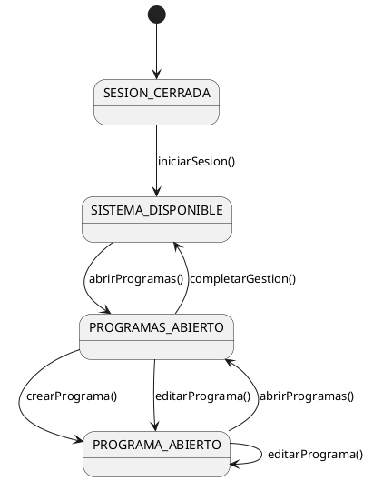

# diagramaDeContexto@disciplinaRequisitos.RUP

## ¿Por qué?

El Rational Unified Process (RUP) es una metodología robusta y ampliamente adoptada para el desarrollo de software. Sin embargo, sus artefactos tradicionales de requisitos presentan limitaciones significativas que dificultan la validación formal de sistemas y la comunicación efectiva de flujos de navegación.

### Limitaciones de los artefactos estándar de RUP

#### Precondiciones implícitas y redundantes

Las precondiciones de los casos de uso se especifican textualmente en cada especificación individual. Esto genera:

- **Redundancia masiva**: La misma precondición ("el usuario debe estar autenticado") se repite en múltiples casos de uso. En un sistema con 50 casos de uso, si 45 requieren autenticación, esa precondición debe escribirse 45 veces.
- **Inconsistencias ocultas**: Variaciones en la redacción pueden ocultar discrepancias conceptuales
- **Validación manual**: No existe mecanismo formal para verificar que las precondiciones son alcanzables

**Ejemplo de especificación tradicional**:

```
Caso de Uso: Editar Programa
Precondición: El usuario debe estar autenticado
             El programa debe existir previamente
Flujo Principal:
1. El usuario selecciona "Programas" en el menú
2. El sistema muestra lista de programas
3. El usuario selecciona un programa
...
```

Si la precondición de autenticación se omite en un caso de uso, el error solo se detecta mediante revisión manual exhaustiva.

#### Secuencialidad no expresable

Los diagramas de casos de uso tradicionales no representan secuencialidad ni dependencias temporales entre casos de uso. Las relaciones `<<include>>` y `<<extend>>` indican composición funcional, no orden de ejecución.

**Problema**: Un sistema con flujo obligatorio "crear → editar → publicar" no puede expresarse en un diagrama de casos de uso estándar. Esta información queda relegada a especificaciones textuales dispersas, fragmentando el conocimiento del flujo completo.

#### Validación de completitud no formal

No existe mecanismo en RUP estándar para validar formalmente que:

- Todos los casos de uso identificados son alcanzables desde el estado inicial
- No existen estados o contextos del sistema sin salida
- La navegación propuesta es coherente
- No faltan casos de uso necesarios para completar flujos

Esta validación depende completamente de revisiones manuales y la experiencia del analista.

#### Separación artificial entre artefactos

El modelo del dominio, los casos de uso y las especificaciones textuales son artefactos independientes. Su integración conceptual depende de la habilidad del equipo para mantener trazabilidad manual entre documentos dispersos.

**Resultado**: Información fragmentada que dificulta la comprensión del sistema completo.

### Deficiencia identificada

La literatura estándar de RUP no documenta el uso de máquinas de estados UML para modelar la perspectiva del actor navegando por el sistema. Como artefactos de modelado conocemos:

- **Máquinas de estados** → para ciclo de vida de objetos del dominio (Pedido: creado → pagado → enviado)
- **Diagramas de casos de uso** → para identificación de funcionalidades (actor → óvalos)

Pero no existe documentación de la integración propuesta en este artículo, donde las máquinas de estados se aplican a la navegación del usuario.

## ¿Qué?

### Diagrama de contexto como máquina de estados UML

Se propone modelar la **perspectiva del actor** navegando por el sistema como una máquina de estados UML, donde:

|||
|-|-|
|**Estados**|Representan contextos o vistas del sistema donde se encuentra el actor<br>Ejemplos: `SESION_CERRADA`, `SISTEMA_DISPONIBLE`, `PROGRAMAS_ABIERTO`, `PROGRAMA_ABIERTO`
|**Transiciones**|Representan casos de uso que el actor ejecuta para cambiar de contexto<br>Ejemplos: `iniciarSesion()`, `abrirProgramas()`, `crearPrograma()`
|**Estado inicial**|Punto de entrada al sistema (típicamente `SESION_CERRADA` o `SISTEMA_INICIAL`)
|**Grafo completo**|Modelo formal de toda la navegación posible y precondiciones visuales

### Diferenciación conceptual fundamental

|||
|-|-|
|**Uso tradicional de máquinas de estados**|Modelar el ciclo de vida de **objetos del dominio**<br>Ejemplo: Pedido → creado → pagado → enviado → entregado
|**Uso propuesto aquí**|Modelar el ciclo de **navegación del actor** por el sistema<br>Ejemplo: Usuario → autenticado → navegando menú → editando programa

Este es un **salto conceptual** no documentado en literatura estándar de RUP: usar la misma notación formal (máquinas de estados UML) para un propósito diferente (perspectiva del usuario, no ciclo de vida de objetos).

### Patrón granular optimizado

El enfoque introduce un patrón recurrente para entidades con operaciones CRUD:

|||
|-|-|
|**Estado de lista**|`X_ABIERTO` - Visualización y selección de entidades
|**Estado de edición**|`X_ABIERTO` - Modificación de datos (crear/editar comparten estado)
|**Transiciones separadas**|`crearX()` y `editarX()` como decisiones independientes del usuario
|**Eliminación in-situ**|`eliminarX()` no cambia de estado (transición autorreflexiva)
|**Edición continua**|`editarX() → X_ABIERTO` (autorreflexiva) para modificación iterativa
|**Retorno unificado**|`completarGestion()` como navegación única al menú principal

**Ejemplo concreto - Gestión de Programas**:

```
SISTEMA_DISPONIBLE → abrirProgramas() → PROGRAMAS_ABIERTO
PROGRAMAS_ABIERTO → crearPrograma() → PROGRAMA_ABIERTO
PROGRAMAS_ABIERTO → editarPrograma() → PROGRAMA_ABIERTO
PROGRAMAS_ABIERTO → eliminarPrograma() → PROGRAMAS_ABIERTO
PROGRAMA_ABIERTO → editarPrograma() → PROGRAMA_ABIERTO
PROGRAMA_ABIERTO → abrirProgramas() → PROGRAMAS_ABIERTO
PROGRAMAS_ABIERTO → completarGestion() → SISTEMA_DISPONIBLE
```

**Rationale del patrón**:

- `crear()` y `editar()` llevan al mismo estado porque el flujo natural es: crear datos mínimos → inmediatamente editar detalles
- `eliminar()` permanece en estado de lista porque típicamente se eliminan múltiples items en secuencia
- La edición continua autorreflexiva permite modificar sin cambiar contexto

### Patrón hub central

|||
|-|-|
|**Estado hub**|`SISTEMA_DISPONIBLE` actúa como punto central de navegación
|**Propósito**|Todas las funcionalidades principales son accesibles desde este estado
|**Retorno**|Todos los flujos pueden volver al hub mediante casos de uso de finalización

Este patrón refleja interfaces de usuario reales donde existe un "menú principal" o "dashboard" desde el cual se accede a todas las funcionalidades.

## ¿Para qué?

### Deficiencias de RUP mitigadas

#### 1. Precondiciones ahora explícitas y validables formalmente

|||
|-|-|
|**Antes**|"Precondición: El usuario debe estar autenticado"<br>Texto repetido en 45 casos de uso
|**Ahora**|Topología del grafo: Si no existe camino desde `[*] → SESION_CERRADA → iniciarSesion() → SISTEMA_DISPONIBLE → casoDeUso()`, el caso de uso es inalcanzable
|**Beneficio**|Validación automática mediante análisis de grafos (alcanzabilidad)

**Validación formal**: Un caso de uso es alcanzable si y solo si existe un camino dirigido desde el estado inicial `[*]` hasta la transición que representa ese caso de uso. Esto es decidible en tiempo lineal mediante DFS (Depth-First Search).

#### 2. Secuencialidad ahora visible

|||
|-|-|
|**Antes**|"El usuario primero crea el programa, luego puede editarlo"<br>Prosa en especificación textual dispersa
|**Ahora**|`PROGRAMAS_ABIERTO → crearPrograma() → PROGRAMA_ABIERTO → editarPrograma() → PROGRAMA_ABIERTO`<br>Secuencialidad explícita en el modelo visual
|**Beneficio**|Comprensión inmediata del flujo completo sin leer múltiples documentos

La secuencialidad obligatoria se hace explícita visualmente. Si existe solo un camino posible entre dos estados, la secuencia es obligatoria. Si existen múltiples caminos, son alternativos.

#### 3. Completitud formalmente validable

El diagrama permite verificación sistemática mediante propiedades de teoría de grafos:

|||
|-|-|
|**Casos de uso alcanzables**|¿Existe camino desde `[*]` hasta cada transición?
|**Estados alcanzables**|¿Existe camino desde `[*]` hasta cada estado?
|**Estados sin salida (deadlock)**|¿Existe camino desde cada estado hasta un estado final o el hub central?
|**Casos de uso omitidos**|¿Existen estados conceptualmente necesarios sin transiciones de entrada/salida?
|**Beneficio**|Validación formal mediante algoritmos estándar (DFS/BFS)

**Algoritmo de validación**:

1. Ejecutar DFS desde `[*]`
2. Marcar todos los estados y transiciones alcanzados
3. Reportar estados/transiciones no marcados como inalcanzables
4. Para cada estado alcanzado, verificar que existe camino de retorno al hub o estado final

#### 4. Integración conceptual de artefactos

|||
|-|-|
|**Modelo del dominio**|Los estados operan sobre entidades del dominio
|**Casos de uso**|Cada transición ES un caso de uso
|**Flujos de navegación**|El grafo ES el flujo completo
|**Beneficio**|Un único artefacto visual sintetiza información fragmentada en múltiples documentos

**Trazabilidad explícita**: Cada transición del diagrama tiene nombre idéntico a un caso de uso en la especificación. Cada estado hace referencia a entidades del modelo del dominio.

### Mejoras introducidas (más allá de mitigar deficiencias)

#### 1. Rigor formal con notación estándar

|||
|-|-|
|**Base teórica**|Máquinas de estados finitos (teoría de autómatas)
|**Notación**|UML State Machine Diagrams (estándar ISO/IEC 19505)
|**Análisis formal**|Propiedades verificables matemáticamente: alcanzabilidad, vivacidad, ausencia de deadlock
|**Simulación**|El grafo puede ejecutarse/simularse para validar flujos antes de implementar
|**Transformación**|Posibilidad de generar prototipos navegables automáticamente a partir del modelo

#### 2. Detección temprana de inconsistencias

Durante el modelado, inconsistencias emergen visualmente de forma inmediata:

|||
|-|-|
|**Estados huérfanos**|Estados sin transición de entrada → caso de uso de navegación faltante
|**Estados sin salida**|Estados sin transición de retorno → navegación rota, usuario "atrapado"
|**Ciclos no intencionales**|Flujos circulares sin escapatoria → experiencia de usuario problemática
|**Redundancia de transiciones**|Múltiples caminos equivalentes → oportunidad de simplificación

**Ejemplo de detección temprana**: Al dibujar el diagrama, si un estado queda aislado visualmente, es evidente inmediatamente que falta conectividad. No es necesario esperar a revisión formal.

#### 3. Comunicación mejorada con stakeholders

|||
|-|-|
|**Usuarios finales**|"¿Este flujo refleja cómo trabajarías?" - Validación intuitiva
|**Desarrolladores**|"¿Entiendes qué pantallas/vistas necesitas?" - Guía de implementación
|**Nuevos miembros del equipo**|Comprensión rápida del sistema completo en un solo diagrama

Un diagrama visual de navegación es **órdenes de magnitud más accesible** que especificaciones textuales de 50 páginas. Permite validación efectiva con usuarios no técnicos.

#### 4. Base para generación de prototipos

|||
|-|-|
|**Ejecutabilidad conceptual**|La máquina de estados es formalmente ejecutable
|**Generación automática**|Herramientas pueden generar prototipos navegables de baja fidelidad
|**Esqueletos de UI**|Crear estructura básica de interfaces de usuario automáticamente
|**Navegación básica**|Implementar lógica de navegación directamente desde el modelo

**Herramientas existentes**: PlantUML permite generar diagramas; herramientas como XState (JavaScript) permiten ejecutar máquinas de estados directamente en código.

#### 5. Validación de experiencia de usuario (UX)

El diagrama revela patrones de navegación que impactan directamente UX:

|||
|-|-|
|**Profundidad de navegación**|Contar aristas desde hub hasta funcionalidad crítica<br>Si requiere >3 clicks, considerar acceso directo
|**Retorno al hub**|¿Es fácil volver al menú principal desde cualquier estado?<br>Patrón `completarGestion()` unificado asegura esto
|**Flujos naturales**|¿La navegación refleja tareas reales del usuario?<br>Validable directamente con usuarios mostrando el diagrama
|**Simetría de navegación**|Si hay camino A→B, ¿hay camino B→A?<br>Asimetría puede indicar problema de diseño

### Comparación con enfoques relacionados

#### Diagramas de casos de uso tradicionales

|||
|-|-|
|**Similitudes**|Ambos modelan funcionalidades del sistema
|**Diferencias**|Casos de uso tradicionales NO muestran secuencialidad<br>Máquinas de estados SÍ muestran orden temporal y precondiciones
|**Relación**|Complementarios: casos de uso identifican funcionalidades, diagrama de contexto las organiza en flujo

#### User Journey Maps (Diseño UX)

|||
|-|-|
|**Similitudes**|Ambos modelan navegación del usuario
|**Diferencias**|Journey maps: informales, narrativos, centrados en emociones<br>Máquinas de estados: formales, ejecutables, centrados en lógica
|**Relación**|El diagrama de contexto puede informar journey maps (estructura lógica), y viceversa (necesidades emocionales)

#### Diagramas de flujo de trabajo (BPMN)

|||
|-|-|
|**Similitudes**|Ambos modelan secuencias de actividades
|**Diferencias**|BPMN: procesos de negocio (multi-actor, paralelo, eventos)<br>Máquinas de estados: perspectiva de un único actor, interacción usuario-sistema
|**Relación**|BPMN es nivel organizacional; diagrama de contexto es nivel interfaz usuario

## ¿Cómo?

### Proceso de construcción del diagrama

#### Paso 1: Identificar estados conceptuales

|||
|-|-|
|**Pregunta clave**|¿En qué "contextos" o "vistas" puede encontrarse el actor?
|**Fuente**|Modelo del dominio + conocimiento del flujo de trabajo real
|**Granularidad**|Un estado por cada contexto visual distinto del sistema
|**Nomenclatura**|`ENTIDAD_ESTADO` (ej: `PROGRAMAS_ABIERTO`, `PROGRAMA_ABIERTO`)

**Ejemplo**: Para gestión académica:

- `SESION_CERRADA` - Usuario no autenticado
- `SISTEMA_DISPONIBLE` - Menú principal
- `PROGRAMAS_ABIERTO` - Visualizando lista de programas
- `PROGRAMA_ABIERTO` - Editando un programa específico

#### Paso 2: Identificar transiciones (casos de uso)

|||
|-|-|
|**Pregunta clave**|¿Qué acciones del actor cambian el contexto?
|**Fuente**|Casos de uso identificados previamente
|**Nomenclatura**|Verbos infinitivos + entidad (ej: `crearPrograma()`, `abrirProgramas()`)
|**Correspondencia**|Cada transición debe corresponder a un caso de uso identificado

**Ejemplo**: Desde `PROGRAMAS_ABIERTO`:

- `crearPrograma()` → `PROGRAMA_ABIERTO`
- `editarPrograma()` → `PROGRAMA_ABIERTO`
- `eliminarPrograma()` → `PROGRAMAS_ABIERTO`
- `completarGestion()` → `SISTEMA_DISPONIBLE`

#### Paso 3: Aplicar patrones arquitecturales

|||
|-|-|
|**Patrón hub central**|Identificar estado central (típicamente `SISTEMA_DISPONIBLE`)<br>Todas las funcionalidades principales accesibles desde aquí
|**Patrón granular**|Para entidades CRUD, aplicar patrón `LISTA ↔ EDICION`
|**Patrón de retorno**|Caso de uso unificado para volver al hub (ej: `completarGestion()`)
|**Estado inicial**|Marcar claramente con `[*] →`

#### Paso 4: Validar completitud

|||
|-|-|
|**Alcanzabilidad**|Verificar que todos los estados son alcanzables desde `[*]`
|**Salida**|Verificar que todos los estados tienen camino de retorno al hub
|**Correspondencia**|Cada caso de uso identificado debe aparecer como transición
|**Simetría**|Verificar que navegación es lógica (si entro a detalle, puedo volver a lista)

**Checklist de validación**:

- [ ] Todos los estados alcanzables desde `[*]`
- [ ] Todos los estados tienen camino de retorno
- [ ] Todos los casos de uso aparecen como transiciones
- [ ] No hay estados huérfanos
- [ ] No hay deadlocks

#### Paso 5: Revisar con stakeholders

|||
|-|-|
|**Con usuarios**|"¿Este flujo refleja cómo trabajarías realmente?"
|**Con desarrolladores**|"¿Entiendes qué pantallas necesitas implementar?"
|**Con analistas**|"¿Falta algún caso de uso? ¿Sobra alguno?"
|**Iteración**|Refinar el diagrama según feedback

### Nivel de abstracción apropiado

|||
|-|-|
|**Fase RUP**|Inception / Elaboration
|**Nivel conceptual**|Contextos del usuario, NO detalles de interfaz
|**NO especifica**|Tecnología (web/móvil/escritorio)<br>Detalles de UI (botones, formularios, colores)
|**SÍ especifica**|Contextos conceptuales del actor<br>Navegación lógica entre contextos<br>Secuencialidad obligatoria vs. alternativa

**Ejemplo de nivel apropiado**:

- ✅ Correcto: `PROGRAMA_ABIERTO` (contexto conceptual)
- ❌ Muy detallado: `FORMULARIO_EDICION_PROGRAMA_CON_TABS` (detalle de interfaz)

### Complementariedad con especificaciones textuales

|||
|-|-|
|**Diagrama de contexto**|Flujo global, precondiciones visuales, navegación, secuencialidad
|**Especificación textual de caso de uso**|Detalles de cada caso de uso: validaciones específicas, mensajes de error, manejo de excepciones, datos exactos

**NO reemplaza** especificaciones detalladas. Las **complementa** proporcionando visión del sistema completo.

### Escalabilidad para sistemas grandes

|||
|-|-|
|**Descomposición por actor**|Un diagrama por cada actor principal del sistema
|**Agrupación por subsistema**|Diagramas separados para módulos independientes
|**Niveles de detalle**|Diagrama de alto nivel (estados principales) + diagramas detallados de sub-flujos
|**Uso de estados compuestos**|UML permite estados que contienen sub-máquinas de estados

**Ejemplo**: Sistema grande con 3 actores:

- Diagrama de contexto - Administrador
- Diagrama de contexto - Usuario estándar
- Diagrama de contexto - Consultor

### Herramientas recomendadas

|||
|-|-|
|**PlantUML**|Diagramas como código, versionables, integrables en documentación
|**Draw.io / diagrams.net**|Editor visual, gratuito, exportación múltiple
|**Enterprise Architect**|Herramienta profesional UML completa
|**Lucidchart**|Colaborativo, basado en web
|**XState**|Ejecutar máquinas de estados directamente en JavaScript (prototipado)

### Ejemplo completo: Sistema de gestión académica

**Estados identificados**:

```
SESION_CERRADA
SISTEMA_DISPONIBLE
PROGRAMAS_ABIERTO
PROGRAMA_ABIERTO
CURSOS_ABIERTO
CURSO_ABIERTO
```

**Transiciones clave**:

```
[*] → SESION_CERRADA
SESION_CERRADA → iniciarSesion() → SISTEMA_DISPONIBLE
SISTEMA_DISPONIBLE → abrirProgramas() → PROGRAMAS_ABIERTO
PROGRAMAS_ABIERTO → crearPrograma() → PROGRAMA_ABIERTO
PROGRAMAS_ABIERTO → editarPrograma() → PROGRAMA_ABIERTO
PROGRAMA_ABIERTO → editarPrograma() → PROGRAMA_ABIERTO (autorreflexiva)
PROGRAMA_ABIERTO → abrirProgramas() → PROGRAMAS_ABIERTO
PROGRAMAS_ABIERTO → completarGestion() → SISTEMA_DISPONIBLE
```

**Código PlantUML**:



### Validación formal mediante teoría de grafos

Sea G = (V, E) un grafo dirigido donde:

- V = conjunto de estados del diagrama de contexto
- E = conjunto de transiciones (casos de uso)

**Propiedades verificables automáticamente**:

|||
|-|-|
|**Alcanzabilidad**|∀v ∈ V, ∃ camino desde estado inicial v₀ hasta v<br>*Algoritmo: DFS desde v₀, marcar alcanzables*
|**Conectividad al hub**|∀v ∈ V (excepto v₀), ∃ camino desde v hasta hub o v₀<br>*Algoritmo: DFS inverso desde hub*
|**Vivacidad**|∀v ∈ V, ∃ al menos una transición saliente (excepto estados finales)<br>*Algoritmo: verificar grado de salida > 0*
|**Completitud**|∀ caso de uso cu identificado, ∃ arista e ∈ E etiquetada con cu<br>*Algoritmo: comparar conjunto de casos de uso con etiquetas de E*

**Complejidad**: Todas estas propiedades son decidibles en tiempo O(V + E) mediante recorridos DFS/BFS.

---

## Propuesta curricular para enseñanza de RUP

### Secuencia metodológica propuesta

|||
|-|-|
|1. **Modelo del dominio**|¿QUÉ existe?<br>Entidades, relaciones, conceptos del negocio
|2. **Actores y casos de uso**|¿QUÉ se puede hacer?<br>Funcionalidades, operaciones del sistema
|3. **Diagrama de contexto**|¿CÓMO y CUÁNDO?<br>Flujo, secuencialidad, precondiciones visuales

Esta secuencia **cierra el ciclo conceptual de requisitos** de forma integrada y validable formalmente.

### Beneficios educativos

|||
|-|-|
|**Pensamiento sistemático**|Obliga a estudiantes a pensar en flujos completos, no solo features aisladas
|**Validación formal**|Enseña a aplicar teoría (grafos, autómatas) en práctica real
|**Integración conceptual**|Conecta artefactos fragmentados en visión unificada
|**Rigor sin burocracia**|Artefacto con valor práctico inmediato, no documentación "porque sí"

### Ejercicio pedagógico propuesto

1. Dar a estudiantes modelo del dominio de un sistema conocido (ej: biblioteca, tienda online)
2. Pedirles identificar casos de uso
3. Pedirles construir diagrama de contexto como máquina de estados
4. Pedirles validar formalmente (alcanzabilidad, completitud)
5. Comparar con enfoque tradicional (solo especificaciones textuales)

**Aprendizaje esperado**: Comprensión profunda de la diferencia entre "listar funcionalidades" vs. "modelar flujos completos validables".

---

## Conclusiones

|||
|-|-|
|**Mitiga deficiencias de RUP**|Precondiciones implícitas, secuencialidad no expresable, validación manual
|**Introduce mejoras significativas**|Rigor formal, validación automática, integración conceptual, base para prototipos
|**Mantiene compatibilidad**|No contradice RUP estándar, lo complementa y extiende
|**Es práctica no documentada**|No aparece en literatura estándar de RUP, debería incluirse

### Recomendaciones

Esta práctica debería ser considerada para:

- **Inclusión en formación** de ingeniería de software
- **Documentación en guías metodológicas** de RUP y procesos ágiles
- **Investigación formal** sobre mejoras metodológicas verificables
- **Adopción en proyectos** como artefacto estándar de requisitos

### Barrera principal para adopción

|||
|-|-|
|**No es técnica**|Usa notación UML estándar, herramientas existentes
|**Es conceptual y cultural**|Requiere reconceptualizar el propósito tradicional de las máquinas de estados<br>De "ciclo de vida de objetos" a "navegación de usuarios"

### Llamado a la comunidad

La separación tradicional entre "requisitos usan casos de uso" y "diseño usa estados" es **artificial y contraproducente**. Las máquinas de estados son **ideales** para modelar navegación de usuarios en fase de requisitos.

Es momento de documentar y adoptar esta práctica formalmente.

---

## Referencias

- Kruchten, P. (2003). *The Rational Unified Process: An Introduction*. Addison-Wesley.
- Rumbaugh, J., Jacobson, I., & Booch, G. (2004). *The Unified Modeling Language Reference Manual*. Addison-Wesley.
- Harel, D. (1987). Statecharts: A Visual Formalism for Complex Systems. *Science of Computer Programming*, 8(3), 231-274.
- Cockburn, A. (2001). *Writing Effective Use Cases*. Addison-Wesley.
- OMG. (2017). *OMG Unified Modeling Language (OMG UML), Version 2.5.1*. Object Management Group.
