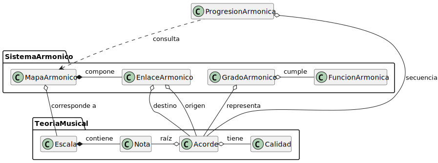

|    
|-:|
|   |

# pyProgresionesArmonicas > Modelo del dominio

|||
|-|-|
Proyecto|pyProgresionesArmonicas
Fase|Inicio
Disciplina|Requisitos
Iteración|1.0
Fecha|2025-12-06
Autor|Manuel Masías

|
|:-:
|**Código fuente:** [modelo-dominio.puml](modelo-dominio.puml)

## Glosario

|Entidad|Descripción|Características|
|-|-|-|
|**Nota**|Unidad básica del sistema musical occidental|Representa las 12 notas cromáticas (C, C#, D, D#, E, F, F#, G, G#, A, A#, B)|
|**Calidad**|Característica tonal de un acorde|Puede ser: Mayor, Menor, Disminuido, Dominante7|
|**Escala**|Conjunto organizado de notas que define una tonalidad (lo que se conoce como contexto tonal)|Actualmente soporta: Mayor y Menor Natural|
|**Acorde**|Combinación de una nota raíz con una calidad|Unidad fundamental del movimiento armónico (ej: C, Dm, G7, F#°)|
|**FunciónArmónica**|Rol que cumple un acorde en el contexto tonal|Puede ser: Tónica, Dominante, Subdominante, Mediante, Superdominante, Sensible|
|**GradoArmónico**|Posición funcional de un acorde dentro de una escala|Identificado por numeración romana (I, II, iii, IV, V, vi, vii°) según el modo|
|**EnlaceArmónico**|Relación direccional válida entre dos acordes|Define los movimientos armónicos permitidos y su naturaleza (diatónica, cromática, modal)|
|**MapaArmónico**|Conjunto completo de enlaces armónicos para una tonalidad específica|Contiene todos los acordes diatónicos, dominantes secundarios y acordes alterados para una tónica y modo dados|
|**ProgresiónArmónica**|Secuencia de acordes encadenados en el tiempo|Representa una sucesión coherente de movimientos armónicos, permitiendo análisis de patrones y cadencias|

## Relaciones entre entidades

|Composición|Agregación|Dependencia|
|-|-|-|
|**Escala** ◆─ **Nota**: Una escala se compone de un conjunto específico de notas. Las notas no tienen sentido aisladas en este contexto.|**Acorde** ○─ **Nota**: Un acorde tiene una nota raíz, pero la nota existe independientemente del acorde.|**ProgresiónArmónica** ⋯> **MapaArmónico**: La progresión consulta el mapa para validar movimientos armónicos coherentes.
|**MapaArmónico** ◆─ **EnlaceArmónico**: El mapa armónico está compuesto por todos sus enlaces. Los enlaces existen solo en el contexto de un mapa.|**Acorde** ○─ **Calidad**: Un acorde tiene una calidad (mayor, menor, etc.), que es un concepto independiente.
||**GradoArmónico** ○─ **Acorde**: Cada grado representa un acorde específico, pero el acorde puede existir fuera del contexto de grado.
||**GradoArmónico** ○─ **FunciónArmónica**: Cada grado cumple una función armónica determinada.
||**EnlaceArmónico** ○─ **Acorde** (origen): El enlace parte de un acorde.
||**EnlaceArmónico** ○─ **Acorde** (destino): El enlace llega a un acorde.
||**MapaArmónico** ○─ **Escala**: El mapa corresponde a una escala específica.
||**ProgresiónArmónica** ○─ **Acorde**: La progresión contiene una secuencia ordenada de acordes.

## Ajustes

|Ajuste|Decisión|Justificación|
|-|-|-|
|**Refinamiento de "Escala"**|Modelar Escala como entidad separada en lugar de como atributo del MapaArmónico.|Permite futuras extensiones a otros modos (menor armónica, menor melódica, modos griegos) sin modificar la estructura del mapa.
|**Separación de "EnlaceArmónico" y "Acorde"**|Los enlaces son entidades independientes que conectan acordes, no propiedades de los acordes.|Un mismo acorde puede tener diferentes enlaces posibles dependiendo del contexto tonal (mayor vs menor), por lo que la relación debe ser explícita.
|**Inclusión de "ProgresiónArmónica"**|Modelar la sucesión de acordes como entidad del dominio.|Es un concepto musical fundamental (análisis de progresiones, identificación de patrones, estudio de cadencias), no solo un artefacto técnico.

## Vocabulario del dominio

||||
|-|-|-|
|Conceptos fundamentales|**Tónica**|Acorde central o "casa" de una tonalidad
||**Resolución**|Movimiento armónico que reduce tensión, típicamente hacia la tónica
||**Tensión**|Calidad de un acorde que busca resolver a otro más estable
||**Cadencia**|Secuencia específica de acordes que cierra una frase musical
||**Cromatismo**|Uso de notas fuera de la escala diatónica
|Tipos de acordes por origen|**Diatónicos**|Formados exclusivamente con notas de la escala
||**Dominantes secundarios**|Acordes de séptima dominante que resuelven a grados diatónicos (ej: V/II, V/IV)
||**Intercambio modal**|Acordes prestados del modo paralelo (ej: IVm en mayor, IV en menor)
||**Sustitutos**|Acordes que pueden reemplazar funcionalmente a otros (ej: SubV7 por V7)
|Movimientos armónicos|**Preparación**|Acordes que establecen el contexto para un acorde posterior
||**Encadenamiento**|Sucesión lógica de dos o más acordes según reglas de conducción armónica
||**Modulación**|Cambio de centro tonal de una tonalidad a otra

## Referencias

- [Casos de uso](../01-casos-de-uso/README.md)
- [Ejemplos de uso](../../../ejemplos.md)
- [Código fuente](../../../script.js)

---

**Versión:** 1.0
**Estado:** Aprobado
**Última actualización:** 2025-12-06
