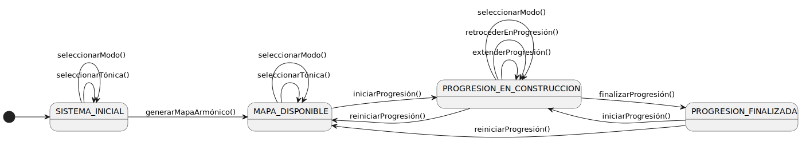

|    
|-:|
|   |

# pyProgresionesArmonicas > Casos de uso > Detalle y Prototipado

|||
|-|-|
Proyecto|pyProgresionesArmonicas
Fase|Inicio
Disciplina|Requisitos
Iteración|1.0
Fecha|2025-12-08
Autor|Manuel Masías

## Casos de uso detallados

Esta sección contiene la especificación detallada y los prototipos de interfaz de todos los casos de uso del sistema, organizados según los estados del diagrama de contexto.

|Configuración del contexto tonal|Gestión de progresión armónica|
|-|-|
|[seleccionarTónica()](seleccionarTonica/README.md)|[iniciarProgresión()](iniciarProgresion/README.md)
|[seleccionarModo()](seleccionarModo/README.md)|[extenderProgresión()](extenderProgresion/README.md)
|[generarMapaArmónico()](generarMapaArmonico/README.md)|[retrocederEnProgresión()](retrocederEnProgresion/README.md)
||[finalizarProgresión()](finalizarProgresion/README.md)
||[reiniciarProgresión()](reiniciarProgresion/README.md)

|Contexto
|:-:
|

## Estructura de cada caso de uso

Cada caso de uso detallado contiene:

1. **Diagrama de especificación** (PlantUML): Conversación Actor-Sistema mediante máquina de estados
2. **Prototipo de interfaz** (SALT): Wireframe visual que valida la presentación de información
3. **Referencias**: Enlaces a casos de uso relacionados y artefactos RUP

## Referencias

- [Diagrama de contexto - Músico](../diagrama-contexto-musico.md)
- [Modelo del dominio](../../00-modelo-del-dominio/README.md)
- [Actores y casos de uso](../README.md)

---

**Versión**: 1.0
**Estado**: En revisión
**Última actualización**: 2025-12-08
