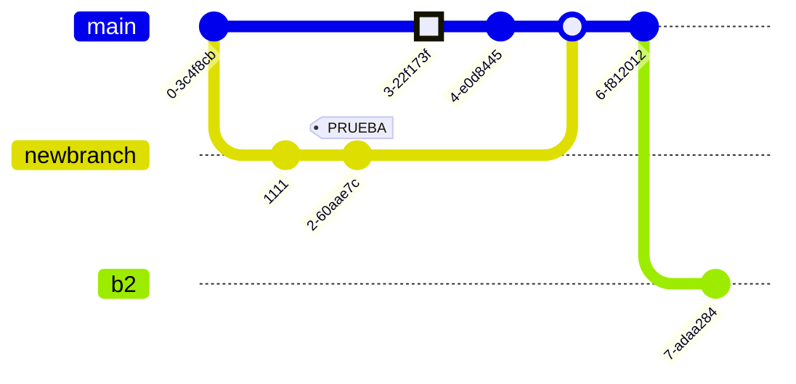
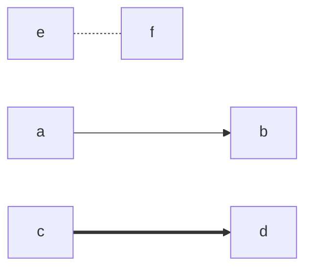
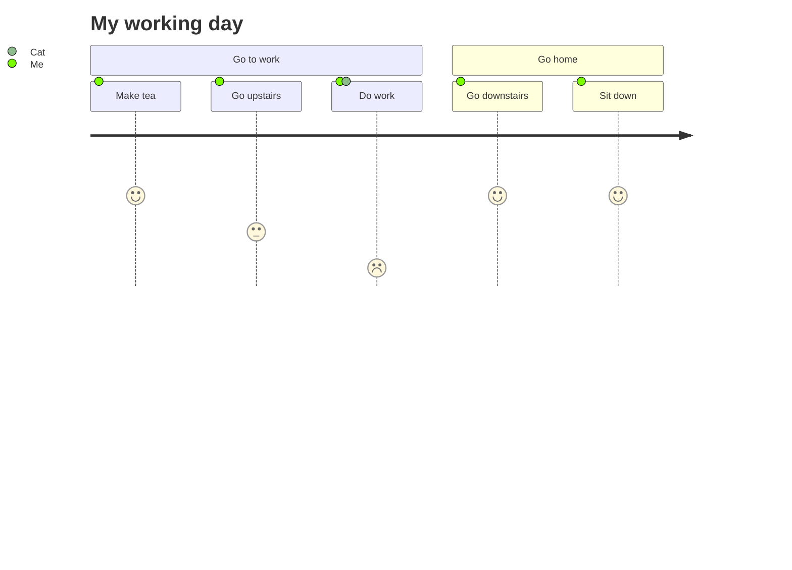
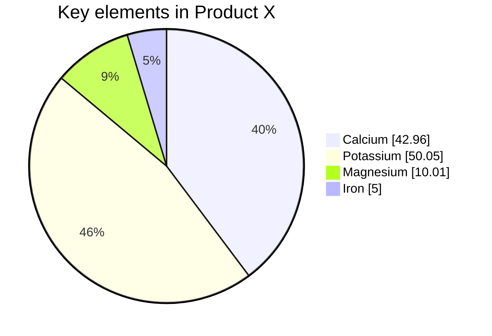

# mermaid

Otra herramienta de [diagramación mediante texto](https://mermaid.js.org/)

Cosas que tiene, que plantUML no:

## Grafico de git

<div align=center>

<table><tr><td>
  
```
gitGraph
    commit "this is a commit"
    branch newbranch
    checkout newbranch
    commit id:"1111"
    commit tag:"PRUEBA"
    checkout main
    commit type: HIGHLIGHT
    commit
    merge newbranch
    commit
    branch b2
    commit
 ```
</td><td>
  

</td></tr></table>
</div>
  


## Grosor de líneas



## User journey



## "Quesitos"




## Característica

<div align=center>

<table><tr><td>

```mermaid
```
</td><td>
  
```
```
</td></tr></table>
</div>
